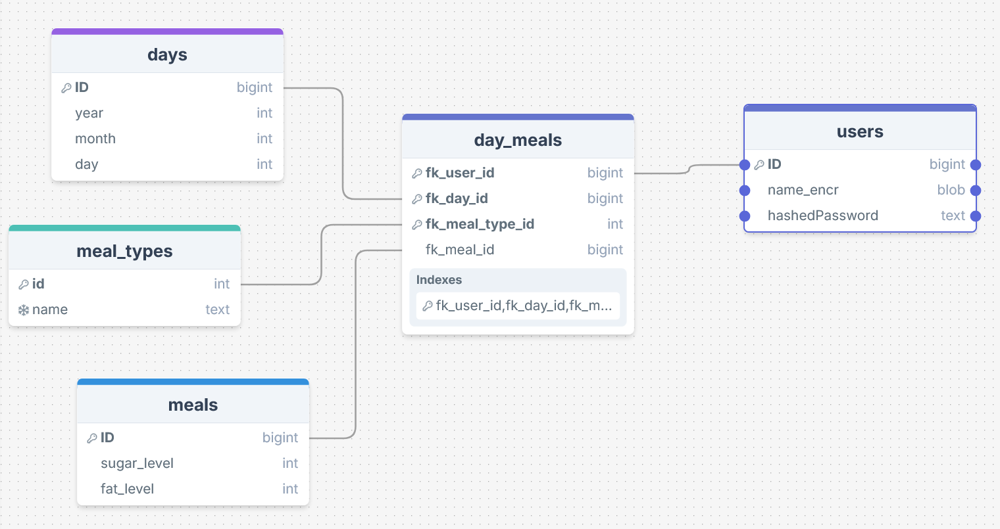

# Flutter Meal Tracker App (Demo)

This is a **demo application** created to demonstrate coding skills and is not intended for real-world use. 

The app showcases how to build a meal tracking system in Flutter, including features like local database storage, online API connection, user authentication, and state management. Please note that this app is for evaluation purposes only, and no real data or production-ready services are included.

## Table of Contents
1. [Features](#features)
2. [Database Schema](#database-schema)
    - [Database Implementation Highlights](#database-implementation-highlights)
3. [Plugins Used](#plugins-used)
    - [SQLite](#sqlite)
    - [Flutter Login Plugin](#flutter-login-plugin)
    - [Easy Localization](#easy-localization)
    - [Provider](#provider)
4. [Setup Guide](#setup-guide)
    - [Configuration](#configuration)
    - [Installation](#installation)
        - [Build Web App](#build-the-web-app)
        - [Build Android Release](#build-android-release)
        - [Android Setup](docs/guides/README_Debug_Android_Flutter.md)
        - [iOS Setup](docs/guides/README_Debug_iOS_Flutter.md)
5. [Running the App](#running-the-app)
6. [Download APK](#download-apk)
7. [Next Steps](#next-steps)
8. [Webapp](#deployed-webapp)
9. [Documentation](#documentation)
    - [Generating App Documentation](#generating-app-documentation)
    - [Excluding Sensitive Data from Documentation](#excluding-sensitive-data-from-documentation)
10. [API Project and Documentation](#api)
    - [API Project Repository](#api-repository)
    - [API Documentation](#api-documentation)
    - [API Endpoint](#api-endpoint)
11. [License](#license)


## Features

- Track meal parameters for Breakfast, Lunch, Dinner, and Snacks.
- Each meal type has selectable Fat and Sugar levels (Low, Medium, High).
- Save and retrieve meal data using a local SQLite database.
- User authentication with a login screen.
- Multi-language support using Easy Localization.
- State management using Provider.
- Simple, user-friendly UI.

## Database Schema


### SQL Representation of the Database

```sql
-- SQL commands for creating tables

-- Create the users table
CREATE TABLE users
(
    ID BIGINT UNSIGNED NOT NULL AUTO_INCREMENT,
    name_encr BLOB NULL,
    hashedPassword TEXT NULL,

    PRIMARY KEY (ID)
) ENGINE = InnoDB;

-- Create the days table
CREATE TABLE days
(
    ID BIGINT UNSIGNED NOT NULL AUTO_INCREMENT,
    year INT NOT NULL,
    month INT NOT NULL,
    day INT NOT NULL,

    PRIMARY KEY (ID)
) ENGINE = InnoDB;

-- Create the meal_types table
CREATE TABLE meal_types
(
    ID BIGINT UNSIGNED NOT NULL AUTO_INCREMENT,
    name TEXT NOT NULL,

    PRIMARY KEY (ID)
) ENGINE = InnoDB;

-- Insert the predefined meal types (breakfast, lunch, dinner, snacks)
INSERT INTO meal_types (name) VALUES
('breakfast'),
('lunch'),
('dinner'),
('snacks');

-- Create the meals table
CREATE TABLE meals
(
    ID BIGINT UNSIGNED NOT NULL AUTO_INCREMENT,
    fat_level INT NOT NULL,  -- 0: Low, 1: Medium, 2: High
    sugar_level INT NOT NULL, -- 0: Low, 1: Medium, 2: High

    PRIMARY KEY (ID)
) ENGINE = InnoDB;

-- Create the day_meals table with composite primary key
CREATE TABLE day_meals
(
    fk_user_id BIGINT UNSIGNED NOT NULL,    -- Foreign key to users
    fk_day_id BIGINT UNSIGNED NOT NULL,     -- Foreign key to days
    fk_meal_type_id BIGINT UNSIGNED NOT NULL, -- Foreign key to meal_types
    fk_meal_id BIGINT UNSIGNED NOT NULL,    -- Foreign key to meals

    PRIMARY KEY (fk_user_id, fk_day_id, fk_meal_type_id), -- Composite primary key

    CONSTRAINT fk_user FOREIGN KEY (fk_user_id) REFERENCES users(ID) ON DELETE CASCADE,
    CONSTRAINT fk_day FOREIGN KEY (fk_day_id) REFERENCES days(ID) ON DELETE CASCADE,
    CONSTRAINT fk_meal_type FOREIGN KEY (fk_meal_type_id) REFERENCES meal_types(ID) ON DELETE CASCADE,
    CONSTRAINT fk_meal FOREIGN KEY (fk_meal_id) REFERENCES meals(ID) ON DELETE CASCADE
) ENGINE = InnoDB;
```

### Tables

- `users`: Stores user information (no encryption used for names).
- `meal_types`: Contains meal types (Breakfast, Lunch, Dinner, Snacks).
- `meals`: Stores the fat and sugar level for each meal.
- `day_meals`: Connects a day to its respective meals.

The app uses a composite primary key in `day_meals` to uniquely identify meals for each day and meal type.


## Database Implementation Highlights

### 1. Single Point of Access with DataHandler

The **DataHandler** acts as the single point of access for retrieving data within the app. Whether the data is fetched from the online database through the API or from the local SQLite database, the interface for the developer remains consistent.

- **How it Works**: The `DataHandler` checks if there is a local database available and then decides whether to use the `ApiHandler` (for online data) or the `DatabaseWrapper` (for local data). This abstraction simplifies data retrieval and eliminates the need for the developer to handle multiple data sources directly.

### 2. Separation of Logic into Repos

Both **ApiHandler** and **DatabaseWrapper**, as well as **DataHandler**, separate their logic into specific repositories (repos) for **meal** and **user interactions**.

- **Why This Matters**: By splitting logic into separate repos for meals and users, the codebase remains more maintainable. Each repository focuses on a specific area of logic, making it easier to modify or extend individual pieces of functionality. This design prevents the creation of large, unmanageable files and promotes clean, organized code.


## Plugins Used

### SQLite
The app uses [SQLite](https://pub.dev/packages/sqflite) to locally store meal data. All meal entries (Fat and Sugar levels) are saved and retrieved from this local database, ensuring offline functionality.

### Flutter Login Plugin
The app uses the [Flutter Login Plugin](https://pub.dev/packages/flutter_login) to handle user authentication. This plugin simplifies the process of adding a login screen with built-in form validation and animations.

### Easy Localization
[Easy Localization](https://pub.dev/packages/easy_localization) is used for multi-language support. All user-facing texts are stored in JSON files and can be easily extended for multiple languages.

### Provider
[Provider](https://pub.dev/packages/provider) is used for state management, allowing efficient handling of state across the app, especially for user interactions with meal data.

## Setup Guide

### Configuration

#### Setting up Configuration and Authentication Files

To run the app properly, you will need to configure the authentication and API settings. The required configuration and authentication files are not included in the repository by default to protect sensitive information.

#### Steps to Set Up:
1. **Copy Template Files:**
   - Navigate to the `lib/constants/` directory.
   - You will find two template files: `authentication.dart.template` and `config.dart.template`.

2. **Create the Required Files:**
   - Copy these template files and remove the `.template` suffix to create the actual files the app will use.
     ```bash
     cp lib/constants/authentication.dart.template lib/constants/authentication.dart
     cp lib/constants/config.dart.template lib/constants/config.dart
     ```

3. **Replace Placeholder Values:**
   - In `authentication.dart`, replace the placeholders with your actual credentials:
     ```dart
     const String kAuthentication_apiToken = 'YOUR_API_TOKEN_HERE';
     const String kAuthentication_pepper = 'YOUR_PEPPER_VALUE_HERE';
     ```
   - In `config.dart`, set the correct API base URL:
     ```dart
     const String kConfig_apiBaseUrl = 'https://your-api-url.com';
     ```

4. **Save and Run the App:**
   - After updating these files with your actual credentials and API settings, you can proceed to run the app as usual.

This step is crucial to ensure the app can communicate with the backend services and handle authentication correctly.


### Installation

#### Build the Web App

To build the web version of the app, use the following command:

```bash
flutter build web --release --web-renderer html --target lib/main.dart
```


#### Build Android Release

To build the android release version of the app, use the following command:

```bash
flutter build apk --release
```


#### Android Setup

For Android setup instructions, refer to the [Android Setup Guide](docs/guides/README_Debug_Android_Flutter.md).

#### iOS Setup

For iOS setup instructions, refer to the [iOS Setup Guide](docs/guides/README_Debug_iOS_Flutter.md).

## Running the App

Once you've completed the setup, you can run the app using the following command:

```bash
flutter run
```

For additional build commands, such as building APKs for Android or iOS builds, refer to the Flutter documentation.

## Download APK

You can download the latest release of the Flutter Meal Tracker App from the link below:

- [Download the Release APK](releases/android)
- [View Releases](https://github.com/Sokrates1989/flutter_engaige_meal_tracker_demo/releases)

## Next Steps

There are several potential enhancements for the Flutter Meal Tracker App:

- **Sync Mechanism for Local and Online Databases**: Currently, the app stores data in separate local and online databases. A sync mechanism could be implemented to allow offline usage while still benefiting from the advantages of an online database. This would enable users to seamlessly transition between offline and online usage.
- **Opt-Out of Online Usage**: For users who prioritize security and privacy, an option to fully opt out of online usage could be provided. This would ensure that no user data is transmitted or stored online, promoting security and data protection.

## Deployed WebApp
The App has been built as web-app and can be found here: https://engaige.fe-wi.com/

## Documentation
An online version of the project's internal developer documentation can be found at https://doku.engaige.fe-wi.com/

### Generating App Documentation
To generate the project's documentation, you can use the `dart doc` command. This will create documentation for the codebase, including API references and class descriptions.

```bash
dart doc
```

The generated documentation will be located in the `doc/api/` directory. You can open the `index.html` file in a web browser to view the full API documentation.

For more information about Dart documentation generation, refer to the [Dart doc guide](https://dart.dev/tools/dart-doc).


### Excluding Sensitive Data from Documentation

When generating documentation for your app using `dart doc`, there may be certain files or parts of your codebase that you want to exclude from the public API documentation, such as sensitive constants or authentication tokens.

#### Option 1: Use `@nodoc` Annotation

To exclude specific variables, methods, or classes from the documentation, you can use the `@nodoc` annotation. Adding this annotation to any item will prevent Dartdoc from including it in the generated docs.

For example, if you want to exclude sensitive constants like API tokens:

```dart
/// @nodoc
const String kAuthentication_apiToken = 'your-api-token';
/// @nodoc
const String kAuthentication_pepper = 'your-pepper';
```

This approach works at the element level and ensures that any item with `@nodoc` will not be included in the documentation.

#### Option 2: Use `dartdoc_options.yaml`

Alternatively, you can use a `dartdoc_options.yaml` file to exclude entire files or libraries from the documentation. Place this file in the root of your project, and specify the files or directories you want to exclude.

Here’s an example of how to exclude specific files:

```yaml
dartdoc:
  exclude:
    - lib/constants/authentication.dart
    - lib/constants/config.dart
```

Make sure that the paths you provide are relative to your project’s root and use POSIX-style paths (with forward slashes `/`).

**Note**: As of now, wildcard exclusion patterns (like `lib/constants/*`) are not supported, so you must list each file you want to exclude individually.

### Verifying the Exclusion

After setting up the `@nodoc` annotations or the `dartdoc_options.yaml`, run the following command to generate your documentation:

```bash
dart doc
```

Check the generated documentation (located in the `doc/api/` directory) to ensure that the sensitive items or files are excluded as expected.

For more detailed information on Dartdoc configurations, you can refer to the official [Dartdoc documentation](https://dart.dev/tools/dart-doc).

## API

### API Repository

You can find the API repository at the following link:
- [API Repository](https://github.com/Sokrates1989/docker_meal_tracker_demo_api_python)

### API Documentation

The API documentation is available here:
- [API Documentation](https://api-python-doku.meal-tracker.fe-wi.com/)

### API Endpoint

The API used by this app can be accessed here:
- [API Endpoint](https://meal-tracker-api-demo.engaige.felicitas-wisdom.com)


## License

This software is provided under an **Evaluation License Agreement**. It may only be used for evaluation purposes and cannot be modified, copied, or distributed without the express permission of the author.

For full details, please refer to the [LICENSE](./LICENSE) file.
